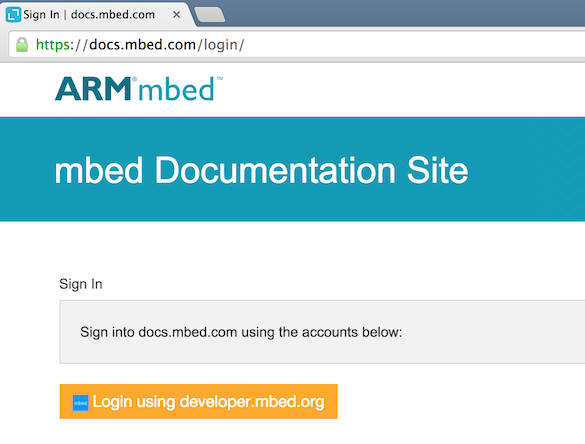
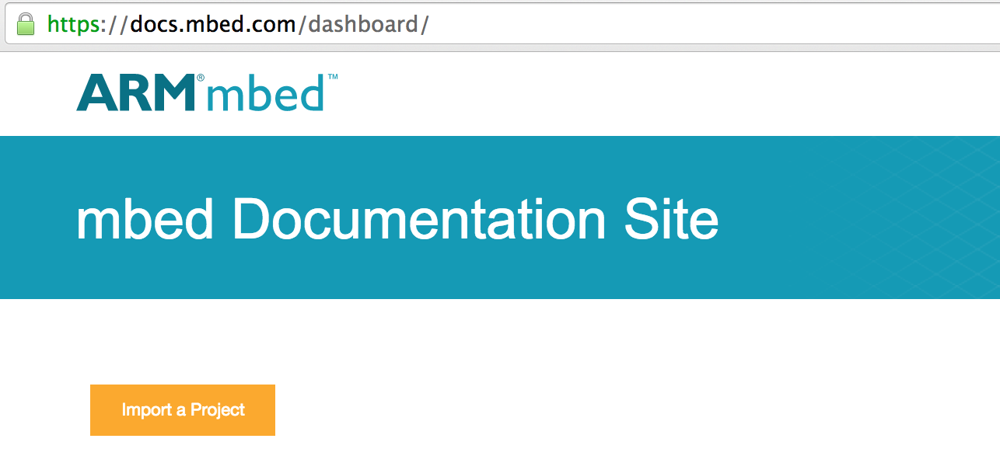
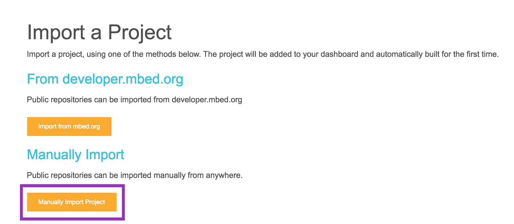
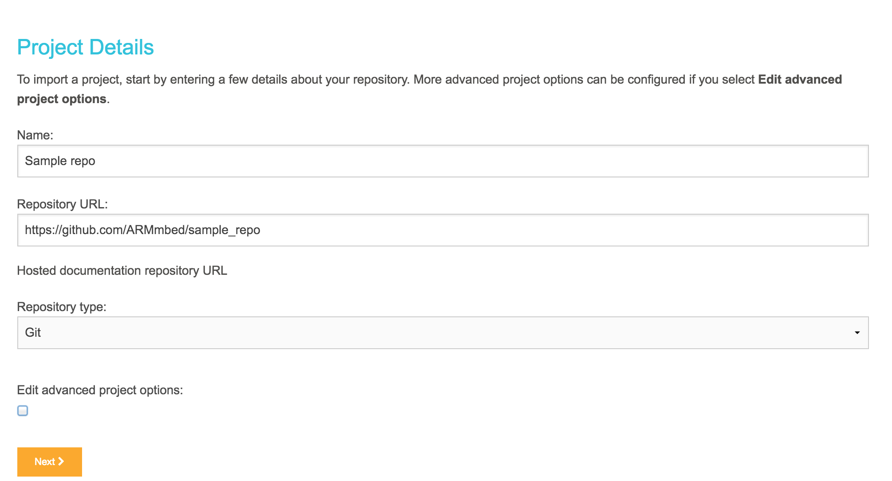
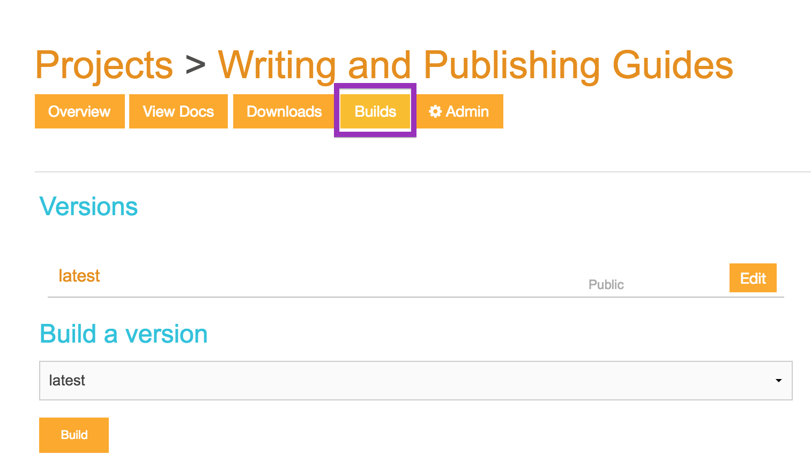
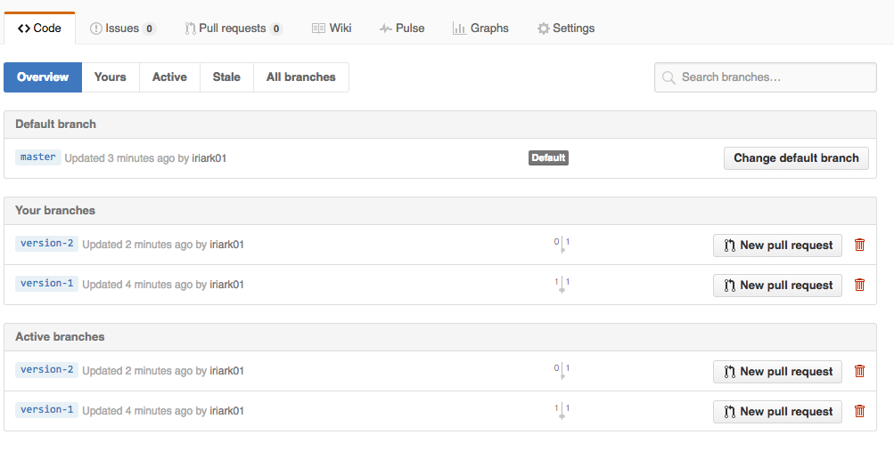
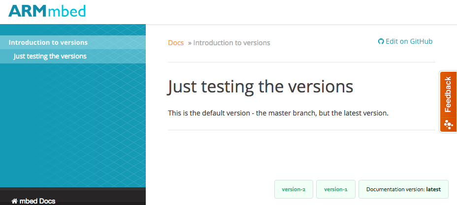
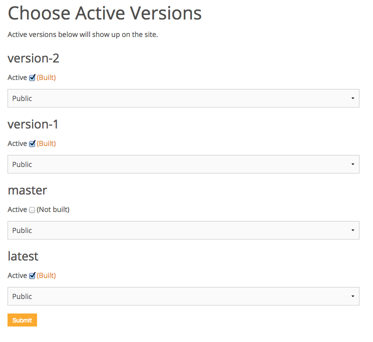

# How to publish mbed documentation

This guide is intended for developers who are trying to add documentation to their projects. It details the tools we use (GitHub, docs.mbed.com and Markdown) and the scope of documentation.

For advice about writing your documentation, see [the writing guide](writing_guide.md).

# What to publish

Documentation about:

1. New things. 

2. Changes to existing things.

2. Deprecations. 

In other words: when you create a repository, or when you edit the code in an existing one, please create (or edit) documentation.

# Using GitHub and Markdown

Our documentation is written in Markdown and lives on GitHub:

1. [Here's a summary of GitHub flavoured Markdown](https://help.github.com/articles/github-flavored-markdown/).

2. Your docs should sit in the same GitHub repository as the code. So if you have a repo at github.com/ARMmbed/repo, you have two options:

	* Put an MD file in the root (https://github.com/ARMmbed/repo/readme.md).

	* Create a directory for your file (https://github.com/ARMmbed/repo/doc/readme.md). 

3. Feel free to create more than one MD file. But you should probably have readme.md as the main, because most people will look at it first. Then you can add files like API.md, changelog.md and deprecated.md.


# Publishing on docs.mbed.com

## Structuring your project

docs.mbed.com uses the [Mkdocs engine](http://www.mkdocs.org/). Read [their documentation](http://www.mkdocs.org/#getting-started) to learn about how they structure a project. 

**Note:** We use the old YML format to organize pages. For example, this is the YML for the project you're currently reading:
```
site_name: Documentation Guides

docs_dir: Docs

pages:
- ['index.md','Introduction to the Documentation Guides']
- ['publishing_guide.md', 'Guides', 'Publishing guide']
- ['style_guide.md', 'Guides', 'Style guide']
- ['writing_guide.md', 'Guides', 'Writing guide']
- ['product_names.md', 'Guides', 'Product names']
```

In ``pages``, the elements are:

1. Page_name.md
1. Section title (not mandatory; the first page in this project isn't under a section title).
1. Page title.

## Publishing Markdown documentation

Documentation living on GitHub can be published on [docs.mbed.com](http://docs.mbed.com) using your mbed account:

- Log into docs.mbed.com with your **developer.mbed.org** credentials.

<span style="background-color: #F0F0F5; text-align:center;display:block; height:100%; padding:10px;"></span>

- You are taken to your dashboard.

- Click **Import a Project**.

<span style="background-color: #F0F0F5; text-align:center;display:block; height:100%; padding:10px;"></span>

- You have two importing options. Click **Manually Import Project**.

<span style="background-color: #F0F0F5; text-align:center;display:block; height:100%; padding:10px;"></span>

- Name your project and enter the GitHub repo URL.

<span style="background-color: #F0F0F5; text-align:center;display:block; height:100%; padding:10px;"></span>

- Review the other options. The default values may well be all you need.

- Click **Next**. You are taken to the project page.

- The project tries to build a first version as soon as it's created. Click **Builds** to see the build's progress. 

<span style="background-color: #F0F0F5; text-align:center;display:block; height:100%; padding:10px;"></span>

* When the build is done, you can click **View Docs** to see your project. 

* Your project's Admin page allows adding tags to your projects (as comma-seperated words). Tags help users find your documents, so we recommend using them.

# Using docs.mbed features

docs.mbed offers a few features that aren't normally available on GitHub-flavoured Markdown.

## Including pages from other repos

If you're working with several repos, but want to publish all of their docs under one docs.mbed project, you can do that without duplicating pages.

1. Create your MD pages in whatever repos you want. Let's say ``source_repo/docs/source.md``.
1. In the repo you want to publish, create an empty MD or use an existing MD. For example ``publishing_repo/docs/publish.md``.
1. Get the link to the *raw* GitHub MD page from the source repo.
1. Paste the raw link in the publishing repo, preceded by an exclamation mark and held within curly brackets:

	``!{https://raw.githubusercontent.com/ARMmbed/source_repo/master/docs/source.md}``

1. Publish your repo.

Note that you cannot include parts of a page - you can only include the whole page.

You can see an example of this in the [uVisor_docs repo](https://github.com/ARMmbed/uvisor_docs).

<span style="background-color:#E6E6E6;border:1px solid #000;display:block; height:100%; padding:10px">**Note:** you must republish your repo to show changes in the source repos.</span>

## Including code in your text (with an "import" button)

If you don't want to copy/paste code into your text, you can include the raw source code. It's the same procedure as including pages, but you use slightly different syntax and you don't need the raw link:

``code-include{https://github.com/ARMmbed/example-mbedos-blinky/blob/master/source/blinky.cpp}``

This will add your code as a code block with an "import to IDE" button.

<span style="background-color:#E6E6E6;border:1px solid #000;display:block; height:100%; padding:10px">**Note:** you must republish your repo to show changes in the source code.</span>

# Versioning your docs

docs.mbed supports publishing several versions of a project, and lets the users flip between versions as they read. 

## Creating branches for documentation

The basis for document versions is GitHub branches - so think before you name your branches, because that is what the users will see on docs.mbed.

These are my branches:

<span style="background-color: #F0F0F5; text-align:center;display:block; height:100%; padding:10px;">

And this is what the version picker looks like when I build my versions:

<span style="background-color: #F0F0F5; text-align:center;display:block; height:100%; padding:10px;">

## Selecting branches to publish

If you have more than one branch, docs.mbed will offer you a list of branches to build in **Dashboard > Admin > Versions**:

<span style="background-color: #F0F0F5; text-align:center;display:block; height:100%; padding:10px;">

In the **Choose Active Versions** section, check the branches you want to build. You can remove them any time you like.

## Building a branch

In the project's **Build** page, the **Build version** drop-down lets you choose which version to build.

# Publishing Doxygen

docs.mbed will try to build Doxygen for your repository along with the regular documentation, so you should follow the previous section's instructions for publishing Markdown.

Note:

1. Please follow the general [Doxygen guidelines](http://www.stack.nl/~dimitri/doxygen/) to write your comments.
1. To generate a main page for your Doxygen, please create a markdown file in your repository's root called ``DOXYGEN_FRONTPAGE.md``.
